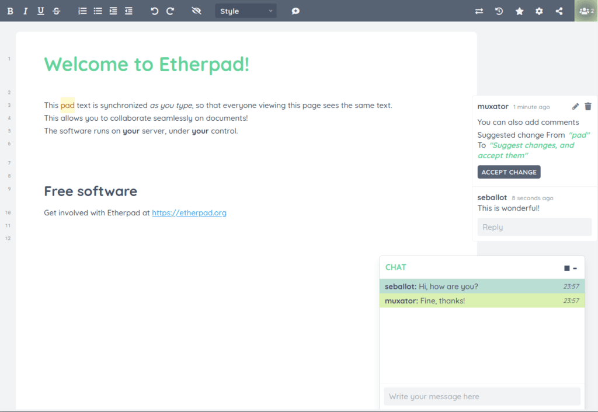

# Etherpad CI/CD pipeline

Deploy Etherpad with CI/CD on Elestio

 
 

# Once deployed ...

You can open Etherpad Admin UI here:

    URL: https://[CI_CD_DOMAIN]/admin
    login: admin
    password: [ADMIN_PASSWORD]

You can open pgAdmin web UI here:

    URL: https://[CI_CD_DOMAIN]:8475
    email: [ADMIN_EMAIL]
    password: [ADMIN_PASSWORD]
